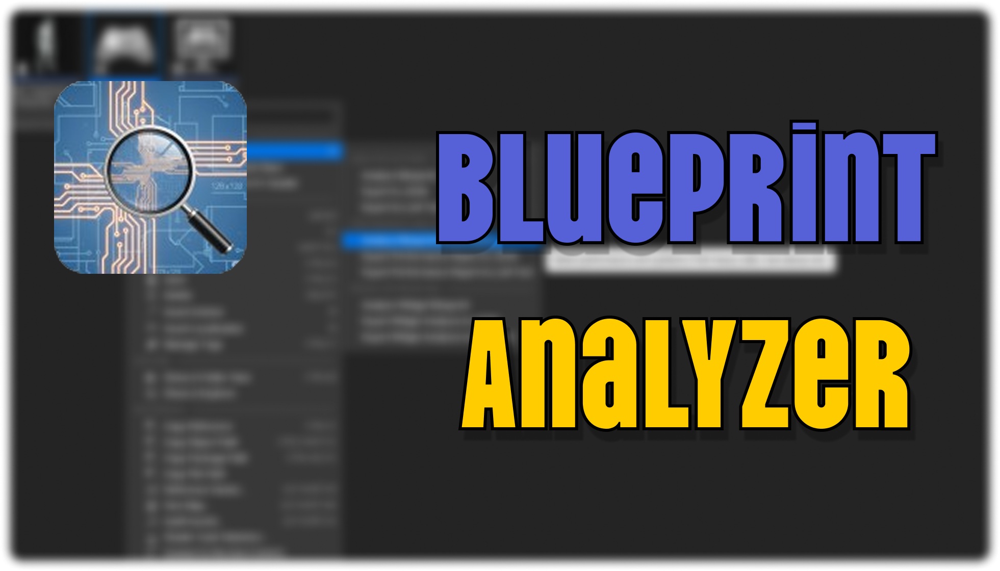

# Blueprint Analyzer Plugin

A comprehensive Unreal Engine 5 editor plugin that performs deep structural analysis of Blueprint assets and converts them into LLM-friendly formats. Goes far beyond simple node/connection extraction — delivers full metadata, execution flow traces, performance anti-pattern diagnostics, project-wide dependency graphs, and UMG optimization scoring. Purpose-built for AI-assisted development, code review, and performance optimization.

## ✨ Key Features

### 🧠 Complete Blueprint Analysis
- **Full Metadata Extraction**: Parent class, implemented interfaces, variables (type · default value · Editable/Replicated/ExposeOnSpawn flags · category · tooltip), custom function signatures (parameters, return type, Pure/Const/Static, access specifier), components (full SCS hierarchy for Actor BPs), event dispatchers, macros, timelines
- **Execution Flow Tracing**: DFS from every Event/CustomEvent/FunctionEntry with Branch/Sequence labeling, latent node detection, cycle guards, and tree-indented output LLMs can read at a glance
- **Full Graph Coverage**: Event graphs, function graphs, macro graphs, delegate signature graphs — no hidden logic
- **Literal Value Extraction**: Hardcoded constants on unconnected input pins (e.g. `Print String("Hello")`) surfaced directly
- **Comment Group Detection**: Nodes wrapped by Comment boxes are grouped under their comment title for semantic context

### 🔄 Blueprint → LLM Conversion
- **🔄 .uasset to Text**: Binary Blueprint files converted to readable text
- **📊 Multiple Export Formats**: JSON for programmatic use, human-readable text for LLM analysis
- **⚡ Massive Data Reduction**: 80-90% smaller than raw uasset — visual layout stripped, logic preserved
- **🎯 AI-Optimized Output**: Specifically formatted for ChatGPT, Claude, and other LLMs
- **🪙 Token Estimation**: Predict token consumption before pasting into an LLM
- **🌐 Universal Blueprint Support**: Actor, Component, Widget, Animation, Interface, Level, Function Library, Macro Library

### ⚡ Blueprint Performance Diagnostics
- **Performance Score (0-100)**: Blueprint-level grading mirroring the UMG system
- **Anti-Pattern Detection**:
  - Expensive calls in Tick (`GetAllActorsOfClass`, `LineTrace`, `GetAllActorsWithInterface`, etc.)
  - Cast in Tick (should be cached once)
  - Bloated BeginPlay initialization (>100 downstream nodes)
  - Heavy Tick graph (>50 downstream nodes)
  - Excessive Cast usage (>20 total)
- **Prioritized Recommendations**: Each issue includes rationale, point deduction, and specific fix suggestion

### 🎨 Widget Blueprint Optimization
- **UMG Performance Scoring (0-100)**: Comprehensive optimization grade with justification
- **Hierarchy Analysis**: Detect deep nesting (>5 levels) and layout complexity
- **Smart Optimization Detection**: Identify missing Invalidation Box and Retainer Box
- **Widget Combination Analysis**: Flag problematic ScaleBox + SizeBox combinations
- **Real Binding Detection**: Reads actual `UWidgetBlueprint::Bindings` — no heuristic guessing
- **Actionable Recommendations**: Specific fix suggestions tied to each detected issue

### 📁 Project-Level Batch Analysis
- **Folder Analysis**: Right-click any Content Browser folder → analyze every Blueprint inside
- **Aggregate Report**: Total nodes, average performance score, top 10 worst offenders sorted by score
- **Dependency Graph**: Extract Spawn / Cast / Call / HardRef references between Blueprints
- **Circular Dependency Detection**: Automated cycle discovery across the project
- **Bulk Token Estimation**: Per-Blueprint LLM token budget upfront

### 🔧 Editor Integration
- **Right-click on any Blueprint**: full per-asset analysis menus
- **Right-click on any Content Browser folder**: batch project analysis
- **Non-destructive**: never modifies your Blueprints
- **Editor-only**: no runtime dependencies, no packaged-game overhead

## 🚀 Installation

1. Copy the `BlueprintAnalyzer` folder to your project's `Plugins` directory
2. Regenerate project files (right-click `.uproject` → Generate Visual Studio project files)
3. Build your project
4. Enable the plugin in Editor → Plugins → Developer Tools → Blueprint Analyzer

## 📋 Usage

### Single Blueprint Analysis

#### Quick Analysis
1. Select any Blueprint (.uasset) in the Content Browser
2. Right-click → **Blueprint Analyzer** → **Analyze Blueprint**
3. View complete metadata summary (type, parent, variables, functions, components, execution paths, etc.)

#### Export for AI / Programmatic Use
1. Select a Blueprint → Right-click → **Blueprint Analyzer**
2. Choose **Export to JSON** (programmatic) or **Export to LLM Text** (AI-friendly)
3. Paste result into ChatGPT / Claude for code review, C++ migration, documentation, bug hunting

### Blueprint Performance Audit
1. Right-click any Blueprint → **Performance Analysis** → **Analyze Blueprint Performance**
2. Review the 0-100 score and prioritized anti-pattern issues
3. Export detailed JSON / LLM Text reports for team review

### Widget Blueprint Optimization
1. Right-click a Widget Blueprint → **Widget Optimization** → **Analyze Widget Blueprint**
2. See optimization score, issues, memory estimate, and recommendations
3. Export detailed JSON / LLM Text reports

### Project-Wide Batch Analysis
1. Right-click any **folder** in the Content Browser → **Blueprint Analyzer**
2. Choose **Analyze Folder** for an aggregate summary popup
3. Export JSON or LLM Text for the full dependency graph, top offenders list, and circular-dependency chains

## 📄 Output Examples

### Blueprint Analysis — LLM Text Format
```
Blueprint Analysis: BP_PlayerCharacter
Analyzed at: 2026-04-20 14:30:22

=== METADATA ===
BlueprintType: ActorBlueprint
ParentClass: Character
Interfaces: IInteractable, ISaveable

--- Components ---
- Mesh (SkeletalMeshComponent)
- CameraBoom (SpringArmComponent) attached to Mesh
- FollowCamera (CameraComponent) attached to CameraBoom

--- Variables ---
- Health : float = 100.0 [ Editable Replicated ] (Category: Stats)
- Inventory : Array<Object<Item>> [ Editable ]

--- Custom Functions ---
- void TakeDamage(float DamageAmount, Object<AActor> Causer)
- bool HasItem(Class<UItem> ItemClass) [Pure] [Const]

--- Event Dispatchers ---
- OnHealthChanged(float NewHealth)

=== NODES ===
- Event [ABC123]: BeginPlay (in graph: EventGraph)
  Outputs: exec:exec

=== EXECUTION FLOW ===

[BeginPlay] in EventGraph
- Event (BeginPlay)
  - Cast<Character>
    [True] - Set Variable: MainCharacter
  - Print String("Player Ready")
```

### Widget Blueprint Optimization Report
```
Widget Blueprint Optimization Report: WBP_MainMenu
Optimization Score: 70/100

=== OPTIMIZATION ISSUES ===
[CRITICAL] Missing Invalidation Box: Dynamic widgets (TextBlock) found but no Invalidation Box is used
  Recommendation: Wrap frequently updating widgets with Invalidation Box (-20 points)

[WARNING] Deep Nesting Beyond 5 Levels: Widget 'Button_Submit' is nested 6 levels deep
  Recommendation: Flatten widget hierarchy (-10 points)
```

### Blueprint Performance Report
```
Blueprint Performance Report: BP_EnemyAI
Performance Score: 55/100

=== ISSUES ===
[CRITICAL] Expensive Call in Tick: 'GetAllActorsOfClass' is called every frame inside Tick
  Recommendation: Cache the result in BeginPlay, use a timer, or event-driven alternative (-25 points)

[WARNING] Cast in Tick: Cast is performed every frame
  Recommendation: Cache the cast result in BeginPlay and reuse the pointer (-10 points)
```

### Project-Level Analysis
```
Project Analysis: /Game/Characters
Blueprints analyzed: 12
Total nodes: 1,847
Average performance score: 78.3/100

=== TOP OFFENDERS (worst performance first) ===
1. BP_EnemyAI (ActorBlueprint) - score 45/100, 3 critical, 287 nodes, ~2841 tokens
2. BP_BossController (ActorBlueprint) - score 60/100, 1 critical, 412 nodes, ~4120 tokens
...

=== CIRCULAR DEPENDENCIES ===
- BP_Player -> BP_Inventory -> BP_Player

=== DEPENDENCIES (47 total) ===
- BP_Player --(Spawn)--> BP_Bullet  [graph: EventGraph]
- BP_Player --(Cast)--> BP_Weapon  [graph: Shoot]
```

## 🎯 Use Cases

### AI-Assisted Development
- **Full-context code review**: metadata + execution flow gives AI enough context to suggest non-trivial fixes
- **Blueprint → C++ migration**: convert logic to optimized C++ with parameter types, signatures, and flow preserved
- **Auto documentation**: generate comprehensive docs for complex Blueprint systems
- **Logic debugging**: identify infinite loops, dead branches, unused variables
- **Architecture analysis**: feed project dependency graph into AI for refactoring suggestions

### Performance Optimization
- **Tick-heavy Blueprint discovery**: find the actual culprits in seconds, not hours of profiling
- **UMG audits**: prevent layout-thrash issues before they ship
- **Team-wide quality gates**: enforce optimization baselines with scoring
- **Memory budget planning**: per-widget estimates

### Team Collaboration & Workflow
- **Readable diffs**: text-based Blueprint representation for meaningful version-control diffs
- **Remote code reviews**: share Blueprint logic without requiring editor access
- **Cross-team communication**: share behavior summaries with designers / QA
- **Legacy system audits**: convert old Blueprints into text for migration planning
- **CI/CD integration**: automated performance/quality checks in build pipelines

## 🔧 Technical Details

### Supported Blueprint Types
- Regular Blueprints (Actor, Component, Object)
- Widget Blueprints
- Animation Blueprints
- Interface Blueprints
- Function Libraries
- Macro Libraries
- Level Blueprints

### What's Extracted
- ✅ Complete node types, names, GUIDs, and graph attribution
- ✅ Function calls with all parameter types
- ✅ Variable get/set operations and definitions
- ✅ Event handling and execution flow
- ✅ Pin types including `PinSubCategoryObject` (Object/Struct resolution)
- ✅ Control flow (branches, loops, sequences, latent nodes)
- ✅ Blueprint inheritance, interfaces, and components
- ✅ Custom events, delegates, and event dispatchers
- ✅ Literal/hardcoded values on input pins
- ✅ Comment-box groupings

### What's Stripped (visual/editor-only)
- ❌ Node positions (X, Y coordinates)
- ❌ Visual styling and colors
- ❌ Editor-specific metadata
- ❌ Thumbnail and preview data

### Scoring Reference
- **UMG optimization scoring details**: see [UMG_OPTIMIZATION_SCORING.md](UMG_OPTIMIZATION_SCORING.md)
- **Blueprint performance scoring**: Tick-heavy calls (-25), Cast in Tick (-10 each), Heavy Tick graph (-15), Bloated BeginPlay (-10), Excessive Casts (-5)

## ⚙️ System Requirements

- **Unreal Engine**: 5.6 or later
- **Platform**: Windows (Win64)
- **Build Tools**: Visual Studio 2022
- **Editor Only**: This plugin only works in the Unreal Editor

## 🤝 Contributing

We welcome contributions! Please:
1. Fork the repository
2. Create a feature branch
3. Make your changes
4. Add tests if applicable
5. Submit a pull request

## 📞 Contact & Support

- **Author**: keemminxu
- **Blog**: [keemminxu.com](https://keemminxu.com)
- **GitHub**: [github.com/keemminxu](https://github.com/keemminxu)
- **Issues**: [GitHub Issues](https://github.com/keemminxu/blueprint-analyzer/issues)
- **Discussions**: [GitHub Discussions](https://github.com/keemminxu/blueprint-analyzer/discussions)

## 📜 License

This project is provided free of charge for use in Unreal Engine projects - see the [LICENSE](LICENSE) file for details.

## 🙏 Acknowledgments

- Epic Games for the Unreal Engine
- The UE developer community for inspiration and feedback
- All contributors who helped improve this plugin

---

**Made with care by [keemminxu](https://keemminxu.com)**
